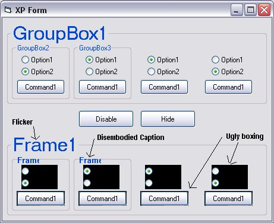

<div align="center">

## Replacent Frame Control for XP


</div>

### Description

Note: If you don't have XP then this is of no use.

A simple replacement frame control. Since the release of Windows XP, VB developers have been plagued with those trusted old standard controls misbehaving themselves. One of the most common problems being with the Frame control. When you place certain controls in a frame control, such as buttons and option boxes, they are drawn with incorrect masking when Visual styles are in use. If you place a frame control inside a frame control then the label of the frame control becomes transparent (you can see the etched edge behind the caption) and is incorrectly sized resulting in an incomplete caption. In addition to these problems, the frame control will flicker during redraw events.

You can fix the frames incorrect masking by adding a picturebox to the frame control and using this as the cointainer, but because there is an extra window, it will result in making the flicker worse. There is a fix to cure the flicker through API, using SetWindowLong with the WS_EX_COMPOSITED style, but I found that caused problems with scrollbars.

After a lot of messing about I decided to write my own Frame Control. It has been based on the standard frame control and there are a few minor bugs, but all in all I think it does a better job in XP than the standard control. The code is fairly simple and the Test project contains a Manifest Resource which will compile into the exe. I have not seen a Manifest in any example code and have not seen any explanation on how to create one, so perhaps this example should have been dedicated to that. I spent a few days messing around with Manifest Files until I found the solution to successfully creating Manifest Res files, but I am keeping that secret for now :( (hint: Padding) thats as much as i'm saying. I am sure that some of you will borrow the Manifest resource for your own apps (I'll be watching).

You may notice the redundant ImageList control. This is an essential part of the control even though it appears to do nothing. If you don't believe me, compile the control with it and make an executable with the control. Run the compiled exe and close. Next build the same control without the Imagelist and re run your compiled exe. What's that? Runs fine you say. Well what happens when you close it? If all was well then you were probably not running XP or if you were then you have found some fix that I know nothing about.

----

Bug Fix 21 January 2003:

----

Accelerator Key support added.
 
### More Info
 


<span>             |<span>
---                |---
**Submitted On**   |2003-01-21 17:51:16
**By**             |[Mick Doherty](https://github.com/Planet-Source-Code/PSCIndex/blob/master/ByAuthor/mick-doherty.md)
**Level**          |Intermediate
**User Rating**    |4.7 (66 globes from 14 users)
**Compatibility**  |VB 6\.0
**Category**       |[OLE/ COM/ DCOM/ Active\-X](https://github.com/Planet-Source-Code/PSCIndex/blob/master/ByCategory/ole-com-dcom-active-x__1-29.md)
**World**          |[Visual Basic](https://github.com/Planet-Source-Code/PSCIndex/blob/master/ByWorld/visual-basic.md)
**Archive File**   |[Replacent\_1533341222003\.zip](https://github.com/Planet-Source-Code/mick-doherty-replacent-frame-control-for-xp__1-36043/archive/master.zip)

### API Declarations

```
IsAppThemed
GetVersionEx
DrawThemeBackground
SetRect
DrawEdge
OpenThemeData
CloseThemeData
DrawThemeText
DrawStateText
GetTextExtentPoint32
InitCommonControlsEx (went a bit overboard with this one)
```


